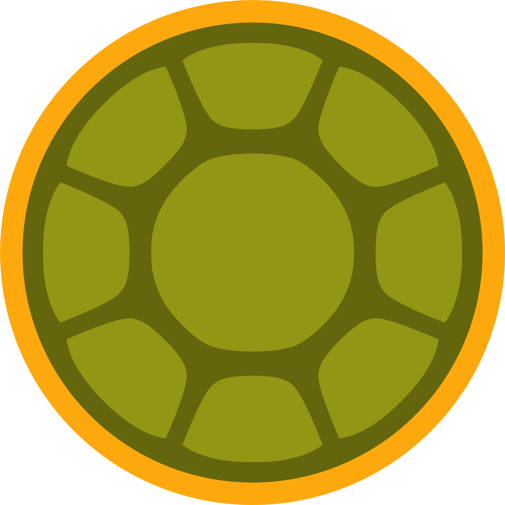

<p align="center">
  
</p>

<h1 align="center">shells</h1>

<p align="center">
  Config-driven page shells for React.<br/>
  Define <em>what</em> — shells render <em>how</em>.
</p>

<p align="center">
  <a href="https://www.npmjs.com/package/@kuarahy/shells"></a>
  
  
  
</p>

---

## The Idea

Every data-grid page has the same anatomy: a title, a table with columns, row actions, and filters. Every form page has fields, validation, and a submit button. You should not write that from scratch each time.

**Shells** turns a typed config object into a full page. One component. Zero repeated layout code.

```tsx
// design-review-page.config.ts  <- this is all a dev touches
export const config: SearchPageConfig = {
  title: "Design Review",
  endpoint: "/api/design-reviews",
  columns: [
    { field: "projectName", header: "Project", sortable: true },
    { field: "status",      header: "Status",  badge: true    },
    { field: "submittedBy", header: "Author"                  },
  ],
  actions: [
    { label: "Approve", endpoint: "/api/design-reviews/:id/approve", variant: "success" },
    { label: "Reject",  endpoint: "/api/design-reviews/:id/reject",  variant: "danger"  },
  ],
  filters: [
    { field: "status", type: "dropdown", options: ["Pending", "Approved", "Rejected"] },
    { field: "team",   type: "dropdown", options: ["Design", "Engineering", "QA"]     },
  ],
};

// page.tsx  <- wired once per app, then never touched again
import { SearchPage } from "@kuarahy/shells";
import { config } from "./design-review-page.config";

export default () => <SearchPage {...config} />;
```

---

## Provider Pattern

Shells are **component-library agnostic**. Wire your UI primitives once at the app root:

```tsx
import { ShellsProvider } from "@kuarahy/shells";
import { MyTable, MyButton, MyDropdown } from "./my-ui-library";

<ShellsProvider
  components={{
    Table:    MyTable,
    Button:   MyButton,
    Dropdown: MyDropdown,
  }}
>
  <App />
</ShellsProvider>
```

Every shell will use those components automatically.

---

## Shells

| Shell | Description |
|---|---|
| `SearchPage` | Data grid with filters, sortable columns, and row actions |
| `FormPage` | Dynamic form with typed fields, conditional visibility, and validation |
| `DetailPage` | Read-only record view with label/value pairs and action buttons |

---

## Install

```bash
npm install @kuarahy/shells
```

**Peer dependencies:** `react >= 18`, `react-dom >= 18`

---

## Golden Rule

**Configuration, not code.**

A new page is a new config file. The shell handles the rest.

---

*A shell is just a structure. You fill it in.*
